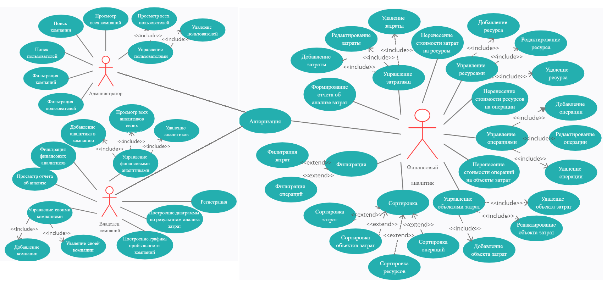

# Course project for valuation of the company cost by the method of analogous companies
A user can register, enter the necessary data and get an estimate of the value of his company.
## Technologies
UI: Swing, AWT
<!--comment-->
Back: JDBC, client-server, Thread
<!--comment-->
Database: MySQL
<!--comment-->
Architecture patterns: MVC, DAO
<!--comment-->
## Description

## Architecture
Server components:

Client components:

